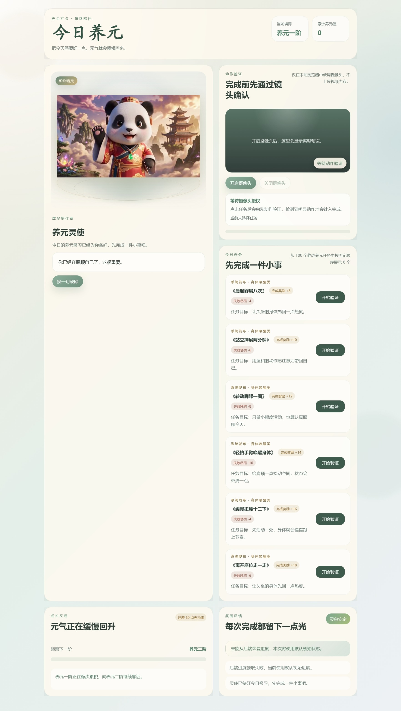

# cultivateImmortality



当前仓库包含"今日养元"系统修炼演示页，以及对应的 OpenSpec 变更文档。

## 项目简介

"今日养元"是一款以轻养生、轻疗愈、轻陪伴为核心的虚拟陪伴演示产品。通过虚拟角色"养元灵使"（熊猫形象）向用户分配健康任务，用户完成任务后获得"养元值"奖励，并触发等级提升反馈，形成一个轻量、直观、具有记忆点的演示闭环。

## 核心功能

### 1. 虚拟陪伴者
- **养元灵使**：以熊猫视频形象呈现的虚拟陪伴角色
- 角色展示区包含立绘、角色名称和实时陪伴语句
- 支持点击"换一句鼓励"按钮切换不同鼓励语句
- 完成任务后自动切换鼓励语，提供温和疗愈的陪伴体验

### 2. 健康任务系统
- 预置100个静态养元任务，涵盖5大类别：
  - 身体唤醒类（如晨起饮温水、肩颈舒展）
  - 呼吸调节类（如闭眼缓息、深呼吸）
  - 饮食节律类（如饭前暂停、倒一杯热水）
  - 情绪修复类（如对自己说辛苦了）
  - 环境整理类（如阳台看天、放下手机）
- 首页展示6个任务卡片，每个任务包含名称、说明、奖励值和分类
- 点击任务卡片即可开始完成

### 3. 动作验证系统
- 使用本地摄像头进行动作验证
- 点击任务后进入验证模式，检测到明显动作后判定完成
- 视频内容仅在本地浏览器中使用，不上传任何数据
- 实时显示验证进度和状态

### 4. 等级成长系统
- 养元值累计达到阈值时自动升级
- 等级体系：养元一阶 → 养元二阶 → 养元三阶 → 养元四阶 → 养元五阶
- 升级时显示明显提示和鼓励语
- 实时显示当前等级、累计养元值和距离下一级的进度

### 5. 即时反馈机制
- 完成任务后获得养元值奖励（如"养元值 +12"）
- 氛围反馈区显示完成记录和鼓励信息
- 柔和的视觉动效和光效增强成就感
- 灵息安定状态指示器展示整体修炼状态

## 主要文件

- `docs/requirements/virtual-companion-prd.md`
- `openspec/changes/build-virtual-companion-demo/`
- `index.html`
- `styles.css`
- `app.js`
- `server.js`

## 本地运行

这个项目现在需要通过本地 Node.js 服务启动，原因有两点：

- 摄像头验证通常要求 `localhost` 或 `https`
- 修为进度会通过后端接口持久化到本地文件

启动方式：

```bash
node server.js
```

启动后打开：

```text
http://localhost:3000
```

## 持久化说明

- 读取进度接口：`GET /api/progress`
- 保存进度接口：`POST /api/progress`
- 本地存储文件：`data/progress.json`

当前实现是单用户、本地文件持久化，适合演示和原型验证。

## 技术栈

- **前端**：原生 HTML5 + CSS3 + JavaScript
- **后端**：Node.js + Express
- **视觉风格**：轻国风疗愈风格
  - 主色调：米白、青绿、浅金、雾蓝
  - 柔和渐变背景与轻纹理
  - 灵性意象与治愈氛围
- **视频素材**：熊猫形象视频循环播放

## 产品特色

1. **轻量化体验**：把"照顾自己"拆成容易完成的小任务，降低心理门槛
2. **虚拟陪伴**：通过养元灵使角色降低打卡枯燥感，提升参与感
3. **游戏化激励**：等级成长系统增强即时满足和演示记忆点
4. **视觉疗愈**：轻国风风格营造安静、舒适的修炼氛围
5. **隐私安全**：摄像头验证仅在本地进行，不上传任何视频数据

## 使用场景

- 学习或工作间隙打开页面完成一个养生动作
- 状态疲惫或情绪低落时，获得一句鼓励和一个低门槛任务
- 团队、客户或内部评审时展示"虚拟陪伴 + 健康任务 + 游戏化激励"的产品雏形
